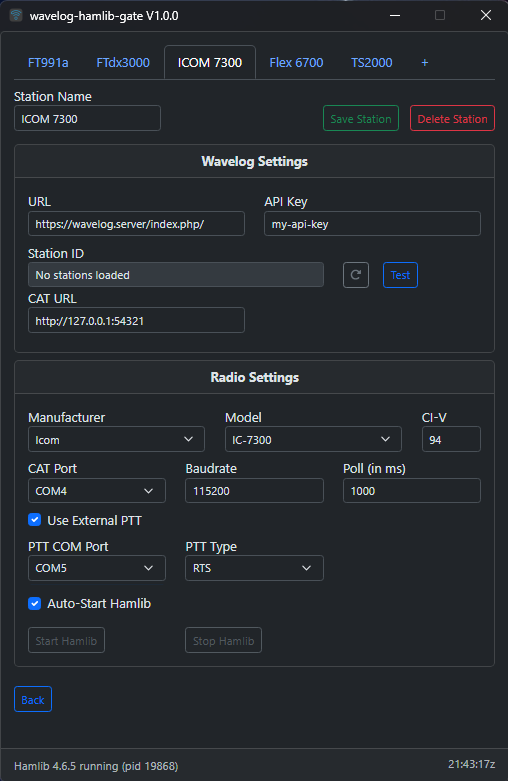

# Wavelog HAMLib Gateway



A modern gateway application that connects **WSJT-X**, **Hamlib**, and other amateur-radio applications to **WaveLog** for seamless CAT control, real-time status updates, and automatic QSO logging.

This project is **based on** and **inspired by** the excellent upstream project **WaveLogGate by DJ7NT**, but rebuilt and redesigned with a **100% Hamlib-only approach**, removing all FLRig code and adding new features such as automatic Hamlib installation and multi-station support.

---

## ✨ Features

* ✔️ **Full Hamlib integration**
* ✔️ **Automatic download & installation of the latest Hamlib release** (from [https://hamlib.github.io/](https://hamlib.github.io/))
* ✔️ **Native rigctld management built directly into the application**
* ✔️ **Multi-station profile support**
* ✔️ **Modernized interface using Bootstrap 5**, with **automatic light/dark mode** based on OS theme
* ✔️ Updated internal architecture, dependencies, and UI
* ✔️ Simplified configuration workflow

All other core WaveLogGate features—such as ADIF intake, WebSocket output, HTTP API, and real-time radio status—have been preserved, improved, or optimized.

---

### Core Functionality

* **Automatic QSO Logging**
  Real-time logging from WSJT-X, Hamlib, or any software capable of sending ADIF via UDP.

* **CAT Radio Control**
  Full CAT control using Hamlib's `rigctld`. Since `rigctld` is active you can use Hamlib's NET rigctl on other software.

* **Multi-Station Profile Support**
  Easily switch between multiple station configurations.

* **Real-Time Radio Status**
  Live frequency, mode, and power information sent to WaveLog.

* **Cross-Platform**
  Works on **Windows**, **Linux**, and **macOS** (macOS not fully tested yet).

* **Automatic Hamlib Setup**
  Downloads and installs the latest Hamlib release and manages `rigctld` for you.

### Advanced Features

* **WebSocket Server**
  Real-time broadcasting of radio status to external apps or dashboards.

* **HTTP API**
  Simple control endpoint for integrations:

  ```
  http://localhost:54321/{frequency}/{mode}
  ```

* **Split Operation**
  Supports split TX/RX operation.

* **ADIF & XML Processing**
  Robust parsing with automatic band detection.

* **Modern Bootstrap 5 UI**
  Responsive, clean, and follows OS dark/light theme automatically.

---

## 📦 Prerequisites

* **WaveLog Instance** (HTTPS required)
* **WaveLog API Key**
  → WaveLog right menu → API-Keys
* **WaveLog Station ID**
  → WaveLog right menu → Station Locations
* **Hamlib**
  * Automatically handled by the application
  * Or you may use an existing rigctld instance
* **WSJT-X** (optional)
  For automatic digital-mode logging

---

## ⚙️ Installation


1. Download the latest release from the project’s GitHub Releases page.

2. Install or extract the application for your platform:

   * **Windows**: Installer or ZIP
   * **Linux**: AppImage, DEB, or binary

3. Launch **Wavelog HAMLib Gateway**.

4. On first run, you must select **Download Latest Hamlib** button to **download and install Hamlib**.

5. Add and setup a new station on the **settings**.

---

## 🛠 Configuration


### 1. WaveLog Settings

Enter:

* Full WaveLog URL (sometimes including `/index.php`)
* API Key
* Station ID
* Use the **Test** button to verify connectivity.
* CAT URL (Custom callback URL)
Changing the callback URL for a radio might disrupt normal work of other application (like WavelogGate).

### 2. Radio Settings

Choose:

* Manufacturer
* Model
* CI-V (if is a Icom radio)
* CAT Serial Port
* Baudrate
* Poll (be carefull on this one)

* External PTT (Hamlib: Some side effects of this command are that when type is set to DTR or RTS, read PTT state comes from the Hamlib frontend, not read from the radio.)
* External PTT Serial Port
* External PTT Serial Port Pin

* Auto-Start Hamlib (this autostarts rigctld when the station is active)

**Note**:Hamlib Start/Stop buttons are only available on the **active** station

### 3. Save Station & go Back

### 4. Active Station

* Choose your active station from the Station List table

### 5. WSJT-X Setup (optional)

In **Settings → Reporting**:

* Enable **Secondary UDP Server**
* Set port to **2333**


---

## 🌐 Ports Used

| Port                | Protocol                          | Purpose |
| ------------------- | --------------------------------- | ------- |
| **2333/UDP**        | ADIF input from WSJT-X and others |         |
| **54321/HTTP**      | Frequency/mode control API        |         |
| **54322/WebSocket** | Real-time radio status            |         |
| **4532**            | Default Hamlib rigctld port       |         |

---

## 🧪 Development

### Requirements

* Node.js (v16+ recommended)
* Git

### Setup

```bash
git clone https://github.com/CS8ABG/wavelog-hamlib-gateway.git
cd wavelog-hamlib-gateway
npm install
npm start
```

### Build

```bash
npm run make
```

---

## 🐞 Troubleshooting

### ▶ No radio connection

* Ensure rigctld is running or let the app manage it.
* Verify correct rig model.
* Check network or serial permissions (Linux: add user to `dialout` group).

### ▶ No QSOs logged

* Confirm WSJT-X "Secondary UDP Server" is enabled on port **2333**.

### ▶ WaveLog errors

* Check API key validity.
* Ensure HTTPS is used.
* Confirm Station ID.

---

## 🤝 Acknowledgements

This project is **heavily inspired by**
**WaveLogGate by DJ7NT**
[https://github.com/wavelog/WaveLogGate](https://github.com/wavelog/WaveLogGate)

Many concepts, workflows, and ideas originate from the original project.
This fork/derivative exists to provide a **Hamlib-only**, modernized, simplified alternative.

---

## 📜 License

Distributed under the same license model as the original WaveLogGate project.
See the included **LICENSE** file for details.

---

